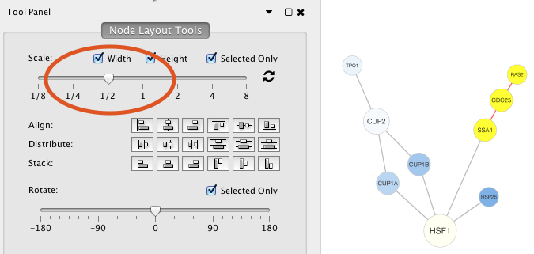
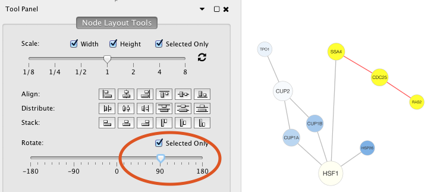
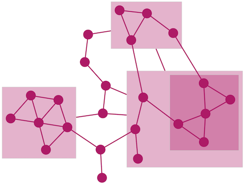

# Navigation and Layout

## Basic Network Navigation

Cytoscape uses a [Zoomable User
Interface](http://en.wikipedia.org/wiki/Zooming_User_Interface) for
navigating and viewing networks. ZUIs use two mechanisms for navigation:
zooming and panning. Zooming increases or decreases the magnification of
a view based on how much or how little a user wants to see. Panning
allows users to move the focus of a screen to different parts of a view.

### Zoom

Cytoscape provides four mechanisms for zooming: toolbar buttons, menu options, keyboard shortcuts and the scroll wheel.

Use the zooming buttons located on the toolbar to zoom in
and out of the interaction network shown in the current network display.
Zoom icons are detailed below:

From Left to Right:

-   **Zoom In**

  - Menu option: **View → Zoom In**
  - Keyboard shortcut: ``Ctrl-Plus`` (``Command-Plus`` on Mac OS X)

-   **Zoom Out**

  - Menu option: **View → Zoom Out**
  - Keyboard shortcut: ``Ctrl-Minus`` (``Command-Minus`` on Mac OS X)

-   **Zoom Out to Display all of Current Network**

  - Menu option: **View → Fit Content**
  - Keyboard shortcut: ``Ctrl-0`` (``Command-0`` on Mac OS X)

-   **Zoom Selected Region**

  - Menu option: **View → Fit Selected**
  - Keyboard shortcut: ``Ctrl-9`` (``Command-9`` on Mac OS X)

Using the scroll wheel, you can zoom in by scrolling up and zoom out by
scrolling downwards. These directions are reversed on Macs with natural
scrolling enabled (the default for Mac OS X Lion and newer versions).

### Pan

There are two ways to pan the network:

-   Left-Click and Drag - You can pan the network view by holding down the left mouse button and moving the mouse.

-   Dragging Box on **[Network
    Overview](Quick_Tour_of_Cytoscape.html#the-network-overview-window)** -
    You can also pan the view by left-clicking and dragging the blue box in the overview panel in the lower part of the view.

## Other Mouse Behaviors

### Select

- Click the left mouse button on a node or edge to select that element.
- Hold down the ``Shift`` or ``Ctrl`` key (``Command`` on Macs) and left-click a node or edge to add it to the selection. Doing the same on a selected element unselects it.
- Hold down the left mouse button on the canvas background and drag the mouse while holding down the ``Shift`` or ``Ctrl`` key (``Command`` on Macs) to select groups of nodes/edges.

### Context

Click the right mouse button (or Ctrl+left mouse button on Macs) on a
node/edge to launch a context-sensitive menu with additional information
about the node/edge.

### Node Context Menu

This menu can change based on the current context. For nodes, it
typically shows:

-   Add

-   Diffuse

-   Edit

-   Select

-   Group

-   Nested Networks

-   Apps

-   External Links

-   Preferences

Edges usually have the following menu:

-   Add

-   Delete

-   Diffuse

-   Edit

-   Select

-   Group

-   Apps

-   Preferences

Apps can contribute their own items into node and edge context menus.
These additions usually appear in the **Apps** section of the context
menu.

#### Nested Network Node Context Menu

-   **Add Nested Network**: Lets the user select any network in
    Cytoscape as the current node's nested network. If the current node
    already has a nested network it will be replaced.

-   **Remove Nested Network**: Removes the currently associated nested
    network from a node. The associated network is not deleted. Only the
    association between the node and the network is removed.

-   **Go to Nested Network**: The current node's nested network will be
    the current network view and have the focus. Should a network view
    for the nested network not exist, it will be created.

More information about nested networks can be found in the **[Nested
Networks](Nested_Networks.html#nested-networks)**
section.

## Manual Layout

The simplest method to manually organize a network is to click on a node
and drag it. All of the selected nodes are moved together.

In addition to the ability to click on a node and drag it to a new
position, Cytoscape now has the ability to move nodes using the arrow
keys on the keyboard. By selecting one or more nodes using the mouse and
clicking one of the arrow keys (←, ↑, →, ↓) the selected nodes will move
one pixel in the chosen direction. If an arrow key is pressed while
holding the Shift key down, the selected nodes will move 15 pixels in the
chosen direction.

## Node Layout Tools
The Tool Panel is available via the menu command:  **View → Show Tool Panel**.

It contains several **Node Layout Tools** that can help to automate or fine tune a layout.  

### Scale
Adjust the Scale slider to change the length of edges.  The position of the nodes will be scaled, not the node sizes. 
Node size can be adjusted using
**[Styles](Styles.html#styles)**.
The images below show selected (yellow) nodes scaled to 50% of the default value.

**Before**

**After**

### Rotate

The Rotate function will change the orientation of the entire
network or a selected portion of the network. The images below show a
network with selected nodes rotated 90 degrees.

**Before**

**After**

### Align, Distribute and Stack

The **Tool Panel** contains buttons to set relative postions of nodes.

**Align** provides
different options for either vertically or horizontally aligning
selected nodes against a line. The differences are in what part of the
node gets aligned, e.g. the center of the node, the top of the node, the
left side of the node. **Distribute** evenly distributes selected nodes
between the two most distant nodes along either the vertical or
horizontal axis. The differences are again a function what part of the
node is used as a reference point for the distribution. **Stack**
vertically or horizontally stacks selected nodes with the full
complement of alignment options. The table below provides a description
of what each button does.

<table cellspacing="0" style="table-layout: fixed; width: 700px">
<caption>Align Options</caption>
<colgroup> <col style="width:80px">                                                                 <col style="width:90px">                                                                         <col style="width:100px">                                                                                   <col style="width:420px"> </colgroup>
<tbody>
<tr> <th class="center">Button</th>                                                                 <th class="center">Before</th>                                                                   <th class="center">After</th>                                                                               <th>Description of Align Options</th> </tr>
<tr> <td class="center "></td>        <td class="center"></td>     <td class="center"></td>         <td class="">Vertical Align Top - The tops of the selected nodes are aligned with the top-most node.</td> </tr>
<tr> <td class="alt center"></td>  <td class="alt center"></td> <td class="alt center"></td>  <td class="alt">Vertical Align Center - The centers of the selected nodes are aligned along a line defined by the midpoint between the top and bottom-most nodes.</td> </tr>
<tr> <td class="center"></td>      <td class="center"></th>     <td class="center"></td>      <td class="">Vertical Align Bottom - The bottoms of the selected nodes are aligned with the bottom-most node.</td> </tr>
<tr> <td class="alt center"></td>    <td class="alt center"></td> <td class="alt center"></td>  <td class="alt">Horizontal Align Left - The left hand sides of the selected nodes are aligned with the left-most node.</td> </tr>
<tr> <td class="center"></td>      <td class="center"></th>     <td class="center"></td>    <td class="">Horizontal Align Center - The centers of the selected nodes are aligned along a line defined by the midpoint between the left and right-most nodes.</td> </tr>
<tr> <td class="alt center"></td>   <td class="alt center"></td> <td class="alt center"></td> <td class="alt">Horizontal Align Right - The right hand sides of the selected nodes are aligned with the right-most node.</td> </tr>
</tbody>
</table>
 

<table cellspacing="0" style="table-layout: fixed; width: 700px">
<caption>Distribute Options</caption>
<colgroup> <col style="width:80px">                                                                <col style="width:90px">                                                                                          <col style="width:100px">                                                                                        <col style="width:420px"> </colgroup>
<tbody>
<tr> <th class="center">Button</th>                                                                <th class="center">Before</th>                                                                                    <th class="center">After</th>                                                                                    <th>Description of Align Options</th> </tr>
<tr> <td class="center "></td>        <td class="center"></td>        <td class="center"></td>         <td class="">Vertical Distribute Top - The tops of the selected nodes are distributed evenly between the top-most and bottom-most nodes, which should stay stationary.</td> </tr>
<tr> <td class="alt center"></td>  <td class="alt center"></td>    <td class="alt center"></td>  <td class="alt">Vertical Distribute Center - The centers of the selected nodes are distributed evenly between the top-most and bottom-most nodes, which should stay stationary.</td>             </tr>
<tr> <td class="center"></td>      <td class="center"></th>        <td class="center"></td>      <td class="">Vertical Distribute Bottom - The bottoms of the selected nodes are distributed evenly between the top-most and bottom-most nodes, which should stay stationary.</td> </tr>
<tr> <td class="alt center"></td>    <td class="alt center"></td>  <td class="alt center"></td>  <td class="alt">Horizontal Distribute Left - The left hand sides of the selected nodes are distributed evenly between the left-most and right-most nodes, which should stay stationary.</td>             </tr>
<tr> <td class="center"></td>      <td class="center"></th>      <td class="center"></td>    <td class="">Horizontal Distribute Center - The centers of the selected nodes are distributed evenly between the left-most and right-most nodes, which should stay stationary.</td> </tr>
<tr> <td class="alt center"></td>   <td class="alt center"></td>  <td class="alt center"></td> <td class="alt">Horizontal Distribute Right - The right hand sides of the selected nodes are distributed evenly between the left-most and right-most nodes, which should stay stationary.</td>             </tr>
</tbody>
</table>
 

<table cellspacing="0" style="table-layout: fixed; width: 700px">
<caption>Stack Options</caption>
<colgroup> <col style="width:80px">                                                                 <col style="width:90px">                                                                                     <col style="width:100px">                                                                                    <col style="width:420px"> </colgroup>
<tbody>
<tr> <th class="center">Button</th>                                                                 <th class="center">Before</th>                                                                               <th class="center">After</th>                                                                                <th>Description of Align Options</th>                       </tr>
<tr> <td class="center "></td>       <td class="center"></td>        <td class="center"></td>         <td class="">Vertical Stack Left - Vertically stacked below top-most node with the left-hand sides of the selected nodes aligned.</td>          </tr>
<tr> <td class="alt center"></td>  <td class="alt center"></td>    <td class="alt center"></td>   <td class="alt">Vertical Stack Center - Vertically stacked below top-most node with the centers of selected nodes aligned.</td>             </tr>
<tr> <td class="center"></td>       <td class="center"></th>        <td class="center"></td>        <td class="">Vertical Stack Right - Vertically stacked below top-most node with the right-hand sides of the selected nodes aligned.</td> </tr>
<tr> <td class="alt center"></td>     <td class="alt center"></td>  <td class="alt center"></td>    <td class="alt">Horizontal Stack Top - Horizontally stacked to the right of the left-most node with the tops of the selected nodes aligned.</td>             </tr>
<tr> <td class="center"></td>      <td class="center"></th>      <td class="center"></td>     <td class="">Horizontal Stack Center - Horizontally stacked to the right of the left-most node with the centers of selected nodes aligned.</td> </tr>
<tr> <td class="alt center"></td>  <td class="alt center"></td>  <td class="alt center"></td> <td class="alt">Horizontal Stack Bottom - Horizontal Stack Center - Horizontally stacked to the right of the left-most node with the bottoms of the selected nodes aligned.</td>             </tr>
</tbody>
</table>
 

## Edge Bend and Automatic Edge Bundling

From Cytoscape 3.0, **Edge Bend** is a regular edge property and can be
used as a part of a **Style**. Just like any other edge property, you
can select a Default Value, a Mapping and use Bypass for select nodes.
In the Styles tab, select the **Bend** property from the **Properties**
drop-down and click on either the Default Value, Mapping or Bypass cell
to bring up the **Edge Bend Editor**. In the editor, you can add as many
handles as you want to the edge using Alt-Click on Windows, Option-Click
on Mac, or Ctrl-Alt-Click on Linux.

To clear all edge bends, select **Layout → Clear All Edge Bends**.

In addition to adding handles manually, you can use the **Bundle Edges**
function to bundle all or selected edges automatically.

1.  Select **Layout → Bundle Edges → All Nodes and Edges**.

2.  Set parameters.

    -   Details of the algorithm is described in [this
        paper (http://www.win.tue.nl/~dholten/papers/forcebundles_eurovis.pdf)](http://www.win.tue.nl/~dholten/papers/forcebundles_eurovis.pdf).

3.  Press OK to run. Edge bundling may take a long time if the number of
    edges is large.

    -   If it takes too long, try decreasing **Maximum Iterations.**

    -   For large, dense networks, try setting **Maximum iterations** in
        the range of 500 - 1000.

Note: The handle locations will be optimized for current location of
nodes. If you move node positions, you need to run the function again to
get proper result.

## Automatic Layout Algorithms

The Layout menu has an array of features for organizing the network
visually according to one of several algorithms, aligning and rotating
groups of nodes, and adjusting the size of the network. Cytoscape
layouts have three different sources, which are reflected in the
**Layout** menu.

Cytoscape Layouts have the option to operate on only the selected nodes,
and all provide a **Settings...** panel to change the parameters of the
algorithm. Most of the Cytoscape layouts also partition the graph before
performing the layout. In addition, many of these layouts include the
option to take either node or edge columns into account. A few of the
layout algorithms are:

### Grid Layout

The grid layout is a simple layout the arranges all of the nodes in a
square grid. This is the default layout and is always available as part
of the Cytoscape core. It is available by selecting **Layout → Grid
Layout**. A sample screen shot is shown above.

### Edge-weighted Spring-Embedded Layout

The spring-embedded layout is based on a "force-directed" paradigm as
implemented by Kamada and Kawai (1988). Network nodes are treated like
physical objects that repel each other, such as electrons. The
connections between nodes are treated like metal springs attached to the
pair of nodes. These springs repel or attract their end points according
to a force function. The layout algorithm sets the positions of the
nodes in a way that minimizes the sum of forces in the network. This
algorithm can be applied to the entire network or a portion of it by
selecting the appropriate options from **Layout → Edge-weighted Spring
Embedded**.

### Attribute Circle Layout

The **Attribute Circle** layout is a quick, useful layout, particularly
for small networks, that will locate all of the nodes in the network
around a circle. The node order is determined by a user-selected node
column. The result is that all nodes with the same value for that column
are located together around the circle. Using **Layout → Attribute
Circle Layout →** ***column*** to put all nodes around a circle using
***column*** to position them. The sample screen shot above shows the a
subset of the galFiltered network organized by node degree.

### Group Attributes Layout

The **Group Attributes** layout is similar to the **Attribute Circle**
layout described above except that instead of a single circle with all
of the nodes, each set of nodes that share the same value for the column
are laid out in a separate circle. The same network shown above (network
generated by PSICQUIC Client) is shown above, using **Layout → Group
Attributes Layout → taxonomy**.

### Prefuse Force Directed Layout

The force-directed layout is a layout based on the "force-directed"
paradigm. This layout is based on the algorithm implemented as part of
the [prefuse toolkit (http://www.prefuse.org/)](http://www.prefuse.org/) provided by Jeff Heer.
The algorithm is very fast and with the right parameters can provide a
very visually pleasing layout. The **Force Directed Layout** will also
accept a numeric edge column to use as a weight for the length of the
spring, although this will often require more use of the **Settings...**
dialog to achieve the best layout. This algorithm is available by
selecting **Layout → Prefuse Force-Directed Layout → (unweighted)** or
the edge column you want to use as a weight. A sample screen shot
showing a portion of the galFiltered network provided in sample data is
provided above.

### Compound Spring Embedder Layout

The [Compound Spring Embedder (CoSE)](http://www.sciencedirect.com/science/article/pii/S0020025508004799)
layout is based on the traditional force-directed
layout algorithm with extensions to handle multi-level nesting (compound nodes),
edges between nodes of arbitrary nesting levels and varying node sizes.
It is the suggested Cytoscape layout for compound graphs,
although it also works very well with noncompound graphs.
It is available by selecting **Layout → Compound Spring Embedder (CoSE)**.

### Circular Layout

This algorithm produces layouts that emphasize group and tree structures
within a network. It partitions the network by analyzing its
connectivity structure, and arranges the partitions as separate circles.
The circles themselves are arranged in a radial tree layout fashion.
This algorithm is available by selecting **Layout → Circular Layout**.

### Hierarchical Layout

The hierarchical layout algorithm is good for representing main
direction or "flow" within a network. Nodes are placed in hierarchically
arranged layers and the ordering of the nodes within each layer is
chosen in such a way that minimizes the number of edge crossings. This
algorithm is available by selecting **Layout → Hierarchical Layout**.

## Layout Parameters

Many layouts have adjustable parameters that are exposed through the
**Layouts → Settings...** menu option. The **Layout Settings** dialog,
which allows you to choose which layout algorithm settings to adjust, is
shown below. The settings presented vary by algorithm and only those
algorithms that allow access to their parameters will appear in the
drop-down menu at the top of the dialog. Once you've modified a
parameter, clicking the **Execute Layout** button will apply the layout.

