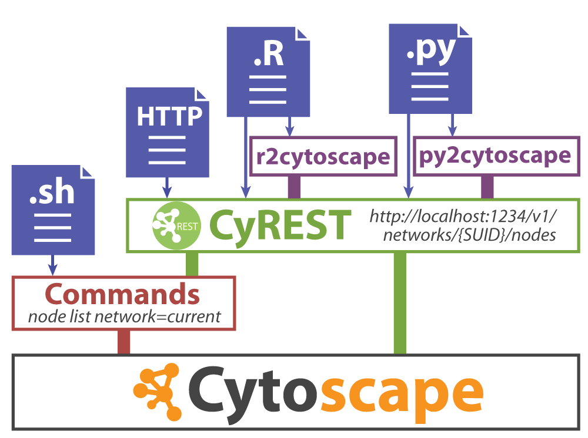
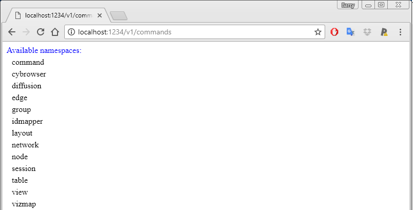
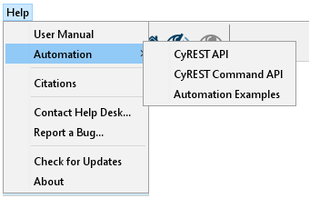
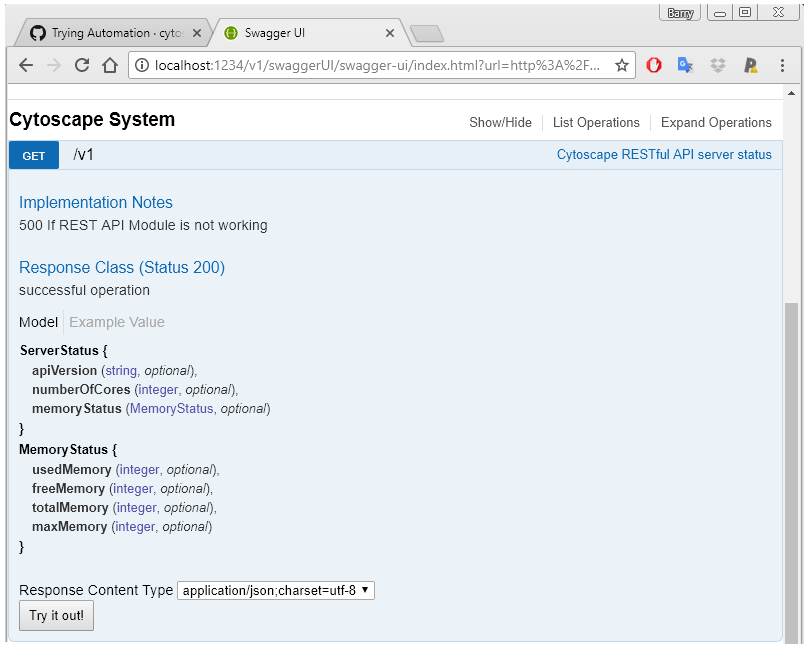
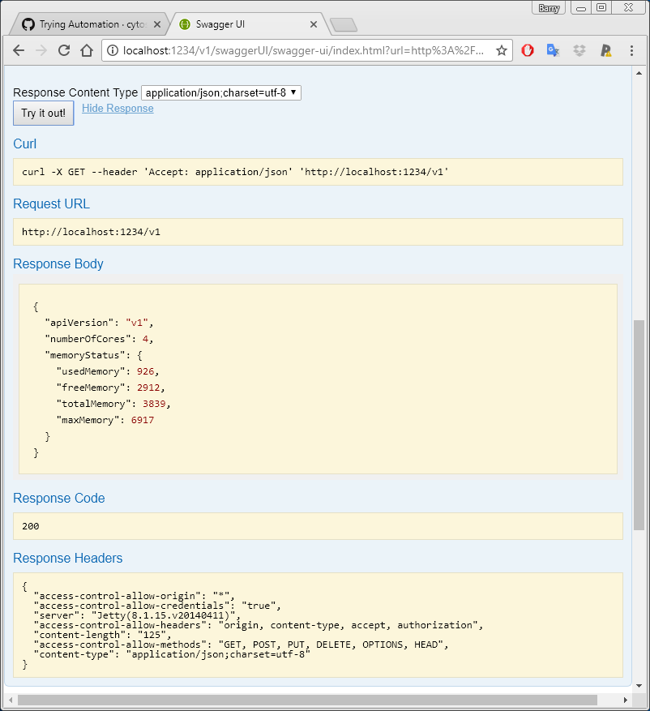

<a id="programmatic_access_to_cytoscape_features_scripting"> </a>
<a id="programmatic_access_to_cytoscape_features"> </a>
<a id="cytoscape_automation"> </a>
# Cytoscape Automation

Cytoscape Automation is a collection of features that enable users to create workflows executed entirely within Cytoscape or by external tools (e.g., [RStudio](https://www.rstudio.com/), [Jupyter](https://jupyter.org/), [GenomeSpace](http://www.genomespace.org/), etc), and whose results are reproducible. This enables Cytoscape to scale to large collections of datasets and to larger more complex workflows than is practical via keyboard and mouse.

Cytoscape Automation exists in two skins – the Commands interface and the Functions interface. Both can accomplish similar results, but are focused on different usage styles. Commands reprise user-initiated interactions (e.g., open session, import data, export image), whereas Functions enable programmers to manipulate and operate on networks as internal Cytoscape data. Commands and Functions both call Cytoscape (and Cytoscape apps) via a REST interface known as CyREST.

This chapter describes how to produce custom workflows using CyREST natively and via Python and R interface libraries. More tutorials and examples are available at the [Cytoscape Automation web page (https://github.com/cytoscape/cytoscape-automation/wiki)](https://github.com/cytoscape/cytoscape-automation/wiki).

Note that for a Cytoscape app to be callable via CyREST, the app must be installed into Cytoscape and the author must have
specifically added automation functionality to it. If there is
an app you would like to call, but which doesn't offer automation, please contact the app author and request that app functionality be 
added. Instructions for adding automation to an app are available on the [Cytoscape Automation web page (https://github.com/cytoscape/cytoscape-automation/wiki)](https://github.com/cytoscape/cytoscape-automation/wiki).

<a id="background"> </a>
## Background

Cytoscape's intuitive graphical user interface is useful for
*interactive* network data integration, analysis, and visualization. It
provides great features for exploratory data analysis, but what happens
if you have hundreds of data files or need to ask someone to execute
your data analysis workflows? It is virtually impossible to apply the
same operations to hundreds of networks manually using a GUI. More
importantly, although you can save your ***results*** as session files,
you cannot save your ***workflows*** if you perform your data analysis
with point-and-click GUI operations. Cytoscape has several options that
support automating your workflows, all under the umbrella of Cytoscape Automation:



The **Commands** feature allows you to script a sequence of Cytoscape commands
and menu items, where commands can have parameter values that would
normally be provided by a user via a Cytoscape dialog box. For example,
*session open file="C:\\myfile.cys"* loads a session from a file
similarly to the **File | Open** menu item. Commands may 
resolve to Cytoscape core functions or automation-enabled apps installed in 
Cytoscape. You can create a command
script file that Cytoscape can execute via the **Tools | Execute Command
File** menu item or on the Cytoscape command line at startup. 

The **CyREST API** feature allows you to access Cytoscape from a separate
application, thereby orchestrating Cytoscape operations via HTTP-based REST calls. 
Your workflows can execute either Commands or Functions in this way.

Automation applications may be written in a general programming
language that keeps its own data structures, performs
complex flow control, or directly manipulates Cytoscape nodes, edges,
attributes, and visual styles. For R and Python, we provide language-specific
interface libraries (e.g., r2cytoscape and py2cytoscape) that present 
Cytoscape Automation in language-friendly terms, and call Cytoscape and apps via 
the CyREST interface.

<a id="commands"> </a>
## Commands


***Commands*** is the built-in Cytoscape feature to automate your
workflow as simple script. You can learn more about Commands in the [Command Tool](Command_Tool.html#command-tool)
section.

<a id="restful_api"> </a>
## CyREST Interface Layer

In some cases, you may need to leverage the complex control and data structures available in a fully featured programming language,
such as [R](http://www.r-project.org/), [Python](https://www.python.org/), [Ruby](https://www.ruby-lang.org/en/) or
[JavaScript](https://en.wikipedia.org/wiki/JavaScript). Such languages enable complex Cytoscape-centric workflows or the integration of Cytoscape into larger workflows. Cytsocape enables progamatic access to both its Commands and Functions via its CyREST interface.

By default, the CyREST interface is enabled and available on TCP/IP port 1234. To verify this, start a web browser on 
your Cytoscape workstation and surf to either http://localhost:1234/v1/ or http://localhost:1234/v1/commands. The first form is a Function that returns basic Cytoscape information as a JSON object:


    
The second form is a Command that returns a list of available Command namespaces:



Note that the list of namespaces will vary depending on the apps you install -- some apps provide Commands in namespaces of their own.

If your workstation has port 1234 already in use, you can specify a different CyREST port in two ways:

* Use the **Edit → Preferences** menu to alter the *rest.port* property to select a different port (e.g., 8888)
* Specify the port on the Cytoscape command line via the *-R* parameter:

```
     cytoscape.bat -R 8888 (for Windows)
     
     ./cytoscape.sh -R 8888 (for Mac or Linux)
```

You can test the new port by using your browser to surf to http://localhost:8888/v1/

Note that if you expect to run more than one instance of Cytsocape on a single workstation, the CyREST port must be unique for each Cytoscape instance. You must use either the property or command line parameter technique to execute each instance with a different CyREST port.

<a id="exploring_cyrest_commands_and_functions"> </a>
### Exploring CyREST Commands and Functions

Cytoscape makes a list of available Commands and Functions available via the **Help → Automation** submenus. The **CyREST API** submenu shows available Functions, and **CyREST Command API** shows available Commands. **Automation Examples** leads to a web portal containing the bulk of documentation, samples and tutorials for Cytsocape Automation in general. 



Notably, **Automation Examples** contains a tutorial that explains how to explore CyREST Commands and Functions: [https://github.com/cytoscape/cytoscape-automation/wiki/Trying-Automation](https://github.com/cytoscape/cytoscape-automation/wiki/Trying-Automation).

The **CyREST API** and **CyREST Command API** submenus document CyREST in a Swagger web application, which allows you to explore CyREST entrypoints by reading about them and invoking them directly (using a *Try it out!*) button. A sample page matching the http://localhost:1234/v1/ Function is:



Note that the page contains a description, input parameters, output values, result code and the *Try it out!* button. Pressing the button executes the Function and shows the actual CyREST call and its results. **Making good use of Swagger as a prototyping tool can greatly reduce code writing and debug time!**



To find out more about how to use CyREST, visit the Cytoscape Automation [tutorial pages (https://github.com/cytoscape/cytoscape-automation/wiki/Trying-Automation)](https://github.com/cytoscape/cytoscape-automation/wiki/Trying-Automation).

Note that Swagger pages reflect functionality in Cytoscape at the time it executes, including Commands and Functions contributed by installed apps. To discover CyREST functionality in uninstalled apps, you must first install them, and then use **Help → Automation** submenus to generate the Swagger pages (or simply reload your Swagger browser page).

<a id="cyrest_and_rpython"> </a>
## cyREST and R/Python

CyREST enables access to Cytoscape Automation features from workflows written in high level languages (e.g., [R](http://www.r-project.org/) and [Python](https://www.python.org/)) and executing in separate environments (e.g., [RStudio](https://www.rstudio.com/) and [Jupyter](https://jupyter.org/)) on the Cytoscape workstation. A workflow can call Commands and Functions either directly via CyREST or via language-specific interface libraries. 

To directly call CyREST Commands and Functions from a workflow, see the [mini-tutorial](Programmatic_Access_to_Cytoscape_Features_Scripting.html#exploring_cyrest_commands_and_functions). 

To understand and get started using language-specific libraries, visit the [Cytoscape Automation web page (https://github.com/cytoscape/cytoscape-automation/wiki)](https://github.com/cytoscape/cytoscape-automation/wiki). The [Workflow Index page](https://github.com/cytoscape/cytoscape-automation/wiki/Workflow-Index) contains useful code samples, and the [Sample Scripts page](https://github.com/cytoscape/cytoscape-automation/tree/master/for-scripters) contains working demonstration projects.

Below is a sample Jupyter-based Python script and the resulting sample output.


(Sample [Jupyter
Notebook](http://nbviewer.ipython.org/github/idekerlab/py2cytoscape/blob/develop/examples/New_wrapper_api_sample.ipynb)
written with cyREST and
[py2cytoscape](https://github.com/idekerlab/py2cytoscape))

